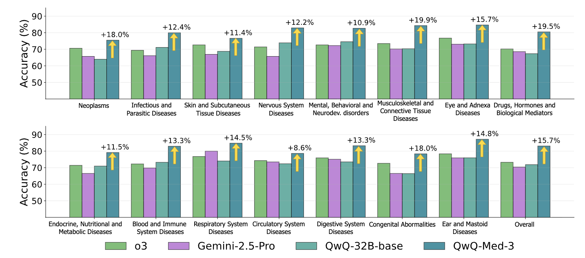

# Bottom-Up Domain-Specific Superintelligence

Official implementation of our paper [Bottom-Up Domain-Specific Superintelligence: A Reliable Knowledge Graph is What We Need](https://arxiv.org/abs/2507.13966) with code, models, and evaluation benchmarks. Also check-out the [official website](https://kg-bottom-up-superintelligence.github.io/) and [twitter thread](https://x.com/bhish_98/status/1948143421136490839). 




### Artifacts

- **Paper**: [https://arxiv.org/abs/2507.13966](https://arxiv.org/abs/2507.13966)
- **QwQ-Med-3 Model**: [bottom-up-superintelligence/qwq_med_3](https://huggingface.co/bottom-up-superintelligence/qwq_med_3)
- **QwQ-Med-2 Model**: [bottom-up-superintelligence/qwq_med_2](https://huggingface.co/bottom-up-superintelligence/qwq_med_2)
- **QwQ-Med-1 Model**: [bottom-up-superintelligence/qwq_med_1](https://huggingface.co/bottom-up-superintelligence/qwq_med_1)
- **ICD-Bench Evaluation Dataset**: [bottom-up-superintelligence/ICD-Bench](https://huggingface.co/datasets/bottom-up-superintelligence/ICD-Bench)


## Setup

### Environment Setup

Create and activate the conda environment ```bottom_up_SI``` with all required dependencies:

```bash
source ./env_setup.sh
conda activate bottom_up_SI
```

This installs:
- PyTorch 2.5.1 with CUDA 12.4 support
- Transformers, datasets, tokenizers, accelerate, PEFT
- vLLM for fast inference
- NetworkX for knowledge graph processing
- Google Generative AI API for curriculum generation with Gemini models

## Curriculum Generation

Generate domain-specific training curriculum using knowledge graphs:

```bash
cd curriculum_generator
export GEMINI_API_KEY="your_gemini_api_key"
source ./generate_curriculum.sh
```

This creates curriculum questions with multi-hop reasoning paths up to 3 hops, generating 24,000 questions saved to `/curriculum_training_data/curriculum_dataset_hop_3.json`.

### Custom Curriculum Generation

```bash
python generate_curriculum.py \
    --max_k_hops 3 \
    --num_questions 24000 \
    --output_dir /curriculum_training_data/ \
    --api_key $GEMINI_API_KEY
```

Parameters:
- `--max_k_hops`: Maximum reasoning path length (default: 3)
- `--num_questions`: Total questions to generate (default: 24000)  
- `--output_dir`: Output directory for generated curriculum
- `--api_key`: Gemini API key for question generation

## Data Processing

### Decontamination and Tokenization

Process the generated curriculum data:

```bash
cd data
source ./data_prep.sh
```

This pipeline:
1. **Decontaminates** the training data using n-gram overlap detection and path de-duplication.
2. **Applies the chat template** to the decontaminated dataset for training

### Manual Data Processing

```bash
# Decontamination
python decontamination.py \
    --train_questions_path /curriculum_training_data/curriculum_dataset_hop_3.json \
    --ngram_size 18

# Tokenization  
python tokenization.py \
    --dataset_train_path /curriculum_training_data/curriculum_dataset_hop_3_decontaminated.json
```

## Training

### Multi-GPU Training

Train the model using SLURM with distributed training:

```bash
cd training
sbatch trainer.sh  # Submit SLURM job
```

### Training Configuration
Key parameters:
- Model: Qwen/QwQ-32B base model
- Batch size: 16 (with gradient accumulation)
- Learning rate: 1e-5 with cosine scheduling
- Training epochs: 8
- Context length: 32678 tokens
- Precision: mixed precision training

### Custom Training

```bash
torchrun \
    --nnodes=1 \
    --nproc_per_node=8 \
    trainer.py \
    --model_name=Qwen/QwQ-32B \
    --train_dataset_path="/curriculum_training_data\tokenized_curriculum_dataset_hop_3_decontaminated/" \
    --learning_rate=1e-5 \
    --num_train_epochs=8 \
    --use_lora
```

## ICD-Bench Evaluation Dataset

ICD-Bench is a comprehensive medical reasoning benchmark dataset containing **3,675 multi-hop questions** across 15 ICD disease categories. Each question is grounded in medical knowledge graphs and requires multi-step reasoning.

### Dataset Structure

- **Questions**: Multi-choice questions with 4 options each
- **Multi-hop reasoning**: 2-5 hop reasoning paths through medical knowledge graphs
- **Categories**: 15 ICD disease categories including:
  - Neoplasms
  - Infectious and Parasitic Diseases
  - Endocrine, Nutritional and Metabolic Diseases
  - Diseases of the Blood and Blood-Forming Organs
  - Mental, Behavioral and Neurodevelopmental Disorders
  - Diseases of the Nervous System
  - Diseases of the Circulatory System
  - Diseases of the Respiratory System
  - Diseases of the Digestive System
  - Diseases of the Skin and Subcutaneous Tissue
  - Diseases of the Musculoskeletal System and Connective Tissue
  - Diseases of the Ear and Mastoid Process
  - Diseases of the Eye and Adnexa
  - Drugs and Biological Mediators
  - Congenital and Chromosomal Anomalies


### Dataset Fields

- `question`: The medical question text
- `options`: List of 4 multiple choice options
- `answer`: Correct answer (A, B, C, or D)
- `k_hops`: Number of reasoning hops in source path (2-5)
- `path`: Knowledge graph reasoning path as list of entity-relation-entity triples
- `category`: ICD disease category
- `difficulty_levels`: Question difficulty classification from level 1 (easiest) to level 5 (haredest)


### Loading the Dataset

```python
from datasets import load_dataset

dataset = load_dataset("bottom-up-superintelligence/ICD-Bench", split='test')
print(f"Dataset size: {len(dataset)}")  # 3,675 questions
```


## Evaluation

### ICD-Bench Evaluation

Evaluate trained models on the ICD-Bench dataset:

```bash
cd evaluation
source ./eval.sh
```

This runs evaluation with:
- **Parallel scaling**: 16 independent thinking traces
- **Sequential scaling**: Iterative refinement of a single thinking trace.

### Custom Evaluation

```bash
# Install evaluation harness
cd evaluation/lm-evaluation-harness
pip install -e .

# Parallel scaling evaluation
lm_eval --model vllm \
    --model_args pretrained=bottom-up-superintelligence/qwq_med_3,dtype=bfloat16,tensor_parallel_size=8 \
    --tasks icdbench \
    --batch_size auto \
    --apply_chat_template \
    --output_path /eval_outputs/qwq_med_3/parallel/ \
    --log_samples \
    --gen_kwargs "max_gen_toks=32768,temperature=0.6"

# Sequential scaling evaluation (with thinking)
lm_eval --model vllm \
    --model_args pretrained=bottom-up-superintelligence/qwq_med_3,dtype=bfloat16,tensor_parallel_size=8 \
    --tasks icdbench \
    --batch_size auto \
    --apply_chat_template \
    --output_path /eval_outputs/qwq_med_3/sequential/ \
    --log_samples "max_gen_toks=32768,max_tokens_thinking=auto,thinking_n_ignore=5,thinking_n_ignore_str=hmm,temperature=0.0"
```


## Citations

Please cite the paper and star this repo if you find it useful, thanks! Feel free to contact bdedhia@princeton.edu, yuvalkansal@princeton.edu or open an issue if you have any questions. 
Cite our work using the following bitex entry:
```bibtex
@misc{dedhia2025bottomupdomainspecificsuperintelligencereliable,
      title={Bottom-up Domain-specific Superintelligence: A Reliable Knowledge Graph is What We Need}, 
      author={Bhishma Dedhia and Yuval Kansal and Niraj K. Jha},
      year={2025},
      eprint={2507.13966},
      archivePrefix={arXiv},
      primaryClass={cs.CL},
      url={https://arxiv.org/abs/2507.13966}, 
}
```